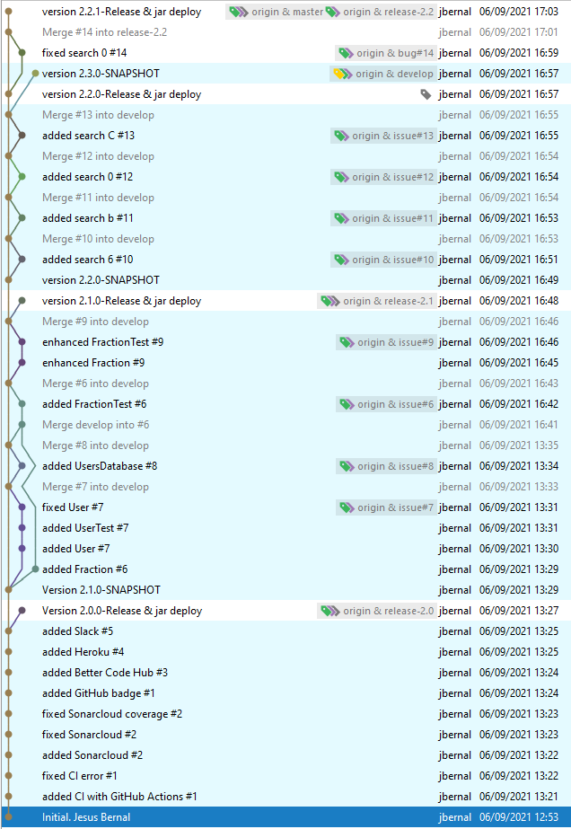

## [Máster en Ingeniería Web por la Universidad Politécnica de Madrid (miw-upm)](http://miw.etsisi.upm.es)
## Ingeniería Web: Visión General (IWVG) DevOps
> Este proyecto es un apoyo docente de la asignatura. Cada release liberada corresponde al código utilizado en clase del curso indicado

[](https://github.com/miw-upm/iwvg-devops/blob/develop/LICENSE.md)
[](https://github.com/miw-upm/iwvg-devops/releases)


### Estado del código
[](https://github.com/miw-upm/iwvg-devops/actions/workflows/continuous-integration.yml)
[](https://sonarcloud.io/summary/new_code?id=es.upm.miw%3Aiwvg-devops)
[](https://iwvg-devops-latest.onrender.com/swagger-ui.html)


### Tecnologías necesarias
`Java` `Maven` `GitHub` `GitHub Actions` `Sonarcloud` `Slack` `Spring-Boot` `GitHub Packages` `Docker` `OpenAPI`

### :gear: Instalación del proyecto
1. Clonar el repositorio en tu equipo, **mediante consola**:
```sh
cd <folder path>
git clone https://github.com/miw-upm/iwvg-devops
```
2. Importar el proyecto mediante **IntelliJ IDEA**  
   * **Open**, y seleccionar la carpeta del proyecto.

### :gear: Ejecución en local con IntelliJ
* Ejecutar la clase **Application** con IntelliJ

### :gear: Ejecución en local con Docker
* Crear la red, solo una vez:
```sh
docker network create devopsNet
```
* Ver redes:
```sh
docker network ls
```
* Comando Docker para crear imagen y arrancar contenedor con la imagen ( :warning: **incluir el punto final** ):
```sh
docker build -t devops:latest .
docker run -d --name devops1  -p 8080:8080 devops
```

* Comando para crear imagen y arrancarla en contenedor mediante docker compose (Se utiliza el fichero **docker-compose.yml**)
```sh
docker compose up --build -d
```

* Cliente Web: `http://localhost:8080`

### :book: Diapositivas
* [Diapositivas de DevOps](docs/miw-iwvg-devops-slides.pdf)   

### :dvd: [Plantilla de la práctica en _docs/iwvg-devops-template.zip_](docs/iwvg-devops-template.zip)

### :page_with_curl: IWVG. Devops. Enunciado de la práctica
> Todo el software deberá estar en ingles.

#### 1. Crear un proyecto (**0.5 pto**)
Crear un proyecto Maven llamado: **iwvg-devops-apellido-nombre**, versión **6.0.0**. Para ello se aporta **zip** de la
plantilla en la plataforma de Moodle.
> Descomprimir la carpeta.
> Recordar cambiar el nombre de la  carpeta.   
> Recordar editar el pom y cambiar el nombre del artefacto (artifactId).
> Importarlo desde IntelliJ.   
> Crear un repositorio en GitHub con el mensaje del primer comit: "Initial. Nombre Apellido"   
 
#### 2. Preparar la gestión mediante Scrum (**0.5 pto**)
> Crear un proyecto de gestión en GitHub y prepararlo para la metodología de Scrum (columnas, etiquetas, hitos...). 
> Recordar hacerlo `public` para que se pueda visualizar.

#### 3. Preparación del ecosistema (**2.5 ptos**)
Se crearán las siguientes 3 historias (**Technical**) pero se trabajarán solo con la ramas **develop** y **staging**.

* :one: Integración continua con **GitHub Actions**. Incluir **Badge** en README con **link**.
* :two: Análisis del código con **Sonarcloud**. Incluir **Badge** en README con **link** a la cuenta de Sonar.
* :three: Deploy con **AWS**. Incluir **Badge** en README con **link**.
> :one:, :two:, :three: representa el orden temporal de desarrollo de los issues.

#### 4. Release (**0.5 pto**)
> Realizar la primera liberación del código, en **staging** y **main** (_**6.0.0-RC1**_ y _**6.0.0**_)

#### 5. Preparación del software a desarrollar (**2 ptos**) y siguiente liberación.
Se crearán las siguientes 4 historias (**Feature**).
* Feature 1ª: :one: añadir el endpoint: **GET /user/{id}**, sin tests. :five: Crear tests del servicio y del endpoint. Los tests deben realizarse sabiendo que hay un seeder.
* Feature 2ª: :two: mejorar el filtro de busqueda añadiendo una tercera condición: **billable**, significa que el usuario es facturable,
eso ocurre cuando sus campos firstName, familyName, email, identity, address, city, province, postalCode tienen contenido real. :eight: añadir los tests de servicio y endpoint.
* Feature 3ª: :three: añadir el endpoint: **DELETE /user/{id}**, sin tests. :four: añadir los tests de servicio y endpoint.
* Feature 4ª: :six: añadir el endpoint: **PUT /user/{id}/active**, sin tests. :seven: añadir los tests de servicio y endpoint.
> :one:, :two:... representa el orden temporal de desarrollo de los features. Cuando un feature se termine se debe incorporar a la rama **develop**. Cuando un feature se inicie, siempre empieza de donde este develop.
> Se debe vigilar la calidad del código, y se cumpla adecuadamente, la IA aunque su código funcione, tenemos que asegurarnos que se cumple las responsabilidades de cada clase y que haga exactamente lo que le pedimos.

> Realizar la segunda liberación del código en **staging** y **main**.

#### 6. Preparación del software a desarrollar (**2 ptos**) y siguiente liberación.
Se crearán las siguientes 2 historias (**Feature**).
* Feature 1ª: :one: añadir el endpoint: **PUT /user/{id}**, sin tests. :three: Crear tests del servicio y del endpoint.
* Feature 2ª: :two: añadir el endpoint: **PATH /user body:[{id,active}]**, actualiza una lista de usuarios solo con el campo active. :four: añadir los tests de servicio y endpoint.

> Realizar la tercera liberación del código en **staging** y **main**.

#### 7. Bug (**1.5 ptos**)
> Suponer que la Feature 2ª anterior existe un error. Error encontrado es que si el user contiene el roll de ADMIN, no se puede desactivar, aspecto que no se tenía en cuenta. Realizar un cambio y proceder a la cuarta liberación del código **staging** y **main**.

### :white_check_mark: Criterios transversales **con pérdida de puntos por falta de calidad**
* Uso correcto del flujo de trabajo ramificado. **Hasta -3 ptos**. 
* Adecuación de la temporalidad de desarrollo según el enunciado. **Hasta -3 ptos**.
* Mantenimiento de calidad del código según GitHub Actions, Sonar. Cobertura >= 80%. **Hasta -3 ptos**.
* Gestión adecuada, completa y equlibrada (estimación, tiempo real...) durante el desarrollo. **Hasta -2 ptos**.
* Commits correctos y completos. **Hasta -2 ptos**. 
* Código limpio, bien formateado y ordenado. **Hasta -2 ptos**. 
* Uso del ingles. **Hasta -1 pto**.


### :clap: Entraga de la práctica
Indicar como texto en la subida la **URL de GitHub**
> **NOTA. Acordarse de dar al botón de envío**

Ejemplo resuelto:



